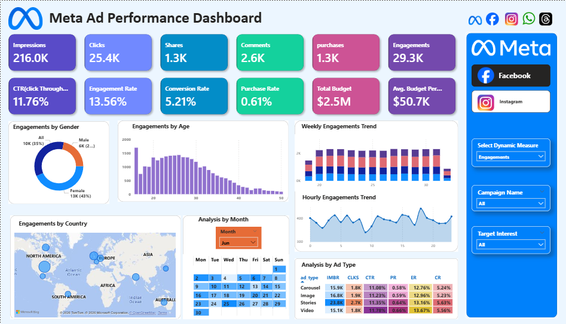

# Meta-Ad-Performance-Dashboard-Power-BI-
Interactive Power BI dashboard for analyzing Meta ad campaign performance
# 📊 Meta Ad Performance Dashboard (Power BI)

## 🚀 Project Overview
This project is an interactive Meta Ad Performance Dashboard built using Power BI to analyze advertising performance across Facebook and Instagram.

The dashboard helps understand campaign performance through key metrics and supports data-driven decision-making.

---

## 🛠️ Tool Used
- Power BI

> Note: The dataset was already cleaned and directly used for dashboard creation.

---

## 📈 Key Metrics
- Impressions  
- Clicks  
- Engagements  
- Shares & Comments  
- Conversion Rate  
- Purchase Rate  
- Total Budget  
- Average Budget per Campaign  

---

## 🔍 Dashboard Features
- Interactive filters (Campaign Name, Platform, Target Interest)  
- Dynamic metric selection (Engagements / Impressions)  
- Audience analysis (Age & Gender)  
- Country-wise performance (Map visualization)  
- Weekly & Hourly trend analysis  
- Ad type comparison (Image, Video, Carousel, Stories)  

---

## 💡 Insights
- Compared Facebook and Instagram ad performance  
- Identified high-performing ad types  
- Analyzed audience engagement by age and gender  
- Observed time-based trends (weekly & hourly)  

---

## 🎯 Outcome
This dashboard helps in understanding marketing performance clearly and supports better decision-making.

---

## 📸 Dashboard Preview

### Facebook Dashboard

### Instagram Dashboard

---

## 📂 Project Files
- Meta Ad Dashboard (.pbix)
- Screenshots
- README.md

---

## 🙋‍♂️ About
Aspiring Data Analyst skilled in Power BI and passionate about transforming data into meaningful insights.
